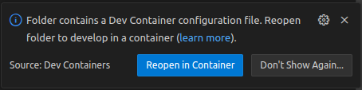

<!--
*******************************************************************************
Copyright (c) 2026 Contributors to the Eclipse Foundation

See the NOTICE file(s) distributed with this work for additional
information regarding copyright ownership.

This program and the accompanying materials are made available under the
terms of the Apache License Version 2.0 which is available at
https://www.apache.org/licenses/LICENSE-2.0

SPDX-FileCopyrightText: 2026 Contributors to the Eclipse Foundation
SPDX-License-Identifier: Apache-2.0
*******************************************************************************
-->

# Common DevContainer for Eclipse S-CORE
This repository contains the common [development container](https://containers.dev) for [Eclipse S-CORE](https://github.com/eclipse-score).
It contains all tools required to develop (modify, build, ...) Eclipse S-CORE.
All tool version are well-defined, and all tools are pre-configured to work as expected for Eclipse S-CORE development.
The container is [pre-built](https://containers.dev/guide/prebuild) in GitHub Actions as part of this repository, tested, published, and ready for use.

Using the pre-built container in an Eclipse S-CORE repository is described in the [Usage](#usage) section.

Modifying the content of the container is explained in the [Development](#development) section.

## Usage

> [!NOTE]
> There are several development environments which support development containers; most notably [Visual Studio Code](https://code.visualstudio.com), but also [IntelliJ IDEA](https://www.jetbrains.com/idea) and others.
> See [here](https://containers.dev/supporting) for a more complete list.
> In the following, we assume that [Visual Studio Code](https://code.visualstudio.com) and its Dev Containers extension is used.
The [Dev Containers extension homepage](https://marketplace.visualstudio.com/items?itemName=ms-vscode-remote.remote-containers) has a description how to get up to speed on Windows, macOS and Linux operating systems.
From here on, we assume that such a development container setup is installed and running.

### First-Time Setup

Add a file called `.devcontainer/devcontainer.json` to your repository.
It should contain the following:

````json
{
    "name": "eclipse-s-core",
    "image": "ghcr.io/eclipse-score/devcontainer:<version>"
}
````

The `<version>` must be a [valid, published release](https://github.com/eclipse-score/devcontainer/tags).
You can also use `main` as `<version>` to automatically follow the `main` branch, and `latest` to follow release tags - but be aware that this can result in undesired updates.

To start using the container, click the **Reopen in Container** button when prompted by Visual Studio Code:



Alternatively, you can press <kbd>Ctrl</kbd> + <kbd>Shift</kbd> + <kbd>p</kbd> and run from there "Dev Containers: Reopen in Container".

The first time you do this, the container will be downloaded.
This may take some time.
Afterwards, Visual Studio Code should show this in the lower left corner of your window:


### Bazel's `linux-sandbox`

`linux-sandbox` makes use of [Linux user namespaces](https://man7.org/linux/man-pages/man7/user_namespaces.7.html).
These only work for `linux-sandbox` as expected, if the following snippet is added to the `.devcontainer/devcontainer.json`:

```json
    "runArgs": [
        "--privileged"
    ]
```

In this case using `--privileged` is [recommended by Bazel](https://bazel.build/docs/sandboxing#sandboxing-strategies),
probably due to lack of alternatives.

> [!NOTE]
> If `linux-sandbox` is not needed, do not add this snippet.

### Inside the Container

Open a Terminal, and - for example - type `bazel build ...` to execute the default build of the repository.

After you have build the code, create [compilation databases](https://clang.llvm.org/docs/JSONCompilationDatabase.html) via Visual Studio Code [Task](https://code.visualstudio.com/docs/debugtest/tasks):

- C++: <kbd>Ctrl</kbd> + <kbd>Shift</kbd> + <kbd>p</kbd> -> `Tasks: Run Task` -> `Update compile_commands.json`
- Rust: <kbd>Ctrl</kbd> + <kbd>Shift</kbd> + <kbd>p</kbd> -> `Tasks: Run Task` -> `Update rust-project.json`

These databases are used by Visual Studio Code to support code navigation and auto-completion with the help of [language servers](https://microsoft.github.io/language-server-protocol/).

Congratulations, you are now a dev container enthusiast 😊.

## Development

> [!NOTE]
> This is about the development *of the DevContainer*, not about development of Eclipse S-CORE *using* the DevContainer.

The [Eclipse S-CORE](https://github.com/eclipse-score) development container is developed using - a development container!
That means, the usage is similarly simple:

````
git clone https://github.com/eclipse-score/devcontainer.git
code devcontainer
````
and "Reopen in Container".

### Repository Structure
Ordered by importance:

* `src/s-core-devcontainer/` contains the sources for the Eclipse S-CORE DevContainer.
It uses pre-existing [DevContainer features](https://containers.dev/implementors/features/) to provide some standard tools like Git, LLVM, and others.
In addition, it uses so-called "local" features (cf. `src/s-core-devcontainer/.devcontainer/s-core-local`) for the remaining tools and configuration.
* `scripts/` contains scripts to build and test the container.
* `.devcontainer/` contains the definition of the DevContainer for **this** repository, i.e. the "devcontainer devcontainer".
There should rarely be a need to modify this.
* `.github/` contains the regular GitHub setup, with code owners and CI.
* `resources/` contains a few screenshots.

### Modify, Build, Test, Use

It is very simple to develop the development container.
You can change files related to the container and then simply run the `scripts/*`.
They are used by the CI, but especially the build and test scripts can be run also locally out of the box:
````console
$ ./scripts/build.sh --amd64 local
[... build output..]
{"outcome":"success","imageName":["ghcr.io/eclipse-score/devcontainer:local-amd64"]}

$ ./scripts/test.sh
[... test output...]
💯  All passed!
````
You can now also use this freshly built development container locally on your machine, e.g. to test the container as part of an Eclipse S-CORE module.
For this you must understand that you have the following situation:
```
+---------------------------------+
|   Development Container A       |
|  +---------------------------+  |
|  | S-CORE DevContainer image |  |
|  +---------------------------+  |
+---------------------------------+
```
`Development Container A` is the one you are running right now to develop the `S-CORE DevContainer` .
So in order to execute `S-CORE DevContainer` on your host (and test it as part of an S-CORE module), you need to

* export this newly built S-CORE DevContainer image
* import the image on your host machine
* use the image name and tag `latest` in the `.devcontainer/devcontainer.json` of the targeted S-CORE module

Concretely, this can be done as follows:

* Run `docker save "ghcr.io/eclipse-score/devcontainer:local-amd64" > export.img` in `Development Container A`.
* On your **host machine** (!!), open a console and run `docker load < /path/to/export.img`.
* In the working copy of the targeted S-CORE module, edit the file `.devcontainer/devcontainer.json` and change the `"image": "..."` entry to `"image": "ghcr.io/eclipse-score/devcontainer:local-amd64"`.
The Visual Studio Code instance related to the targeted S-CORE module will now ask you to rebuild the DevContainer.
If not, press <kbd>Ctrl</kbd> + <kbd>Shift</kbd> + <kbd>p</kbd> and run from there "Dev Containers: Rebuilt Container Without Cache".
Do so, and you have a running instance of `S-CORE DevContainer` related to the targeted S-CORE module.

### Version Pinning

The `S-CORE DevContainer` pins feature and tool versions.
For tools that are not part of a trusted distribution (i.e. downloaded directly), it also pins the SHA256 hash.
While not being the most convenient choice for tool updates, this makes our supply chain much more secure.
Additionally, there are no "surprise updates" which unexpectedly break things.
