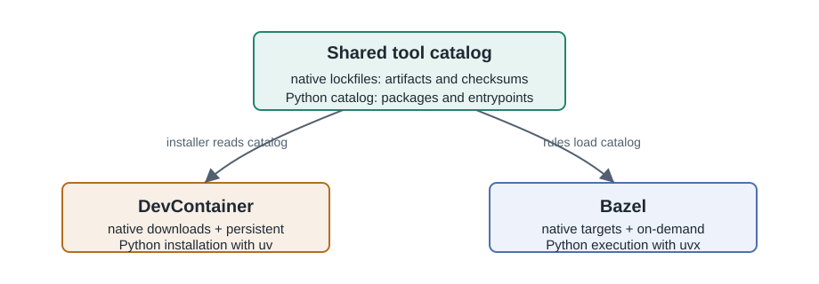

<!--
*******************************************************************************
Copyright (c) 2026 Contributors to the Eclipse Foundation

See the NOTICE file(s) distributed with this work for additional
information regarding copyright ownership.

This program and the accompanying materials are made available under the
terms of the Apache License Version 2.0 which is available at
https://www.apache.org/licenses/LICENSE-2.0

SPDX-FileCopyrightText: 2026 Contributors to the Eclipse Foundation
SPDX-License-Identifier: Apache-2.0
*******************************************************************************
-->

# Maintaining command-line tools

This guide describes how the pinned command-line tools are provided and
maintained. For normal usage, see [Pinned command-line tools](../README.md).

The approach complements the general direction in
[DR-001 Infrastructure Design Decision](https://eclipse-score.github.io/score/main/design_decisions/DR-001-infra.html).

## Delivery contract

One catalog is delivered through two execution paths:

| Component | Responsibility |
| --- | --- |
| `tools/lockfiles/*.lock.json` | Define versions, supported platforms, download locations, checksums, and archive layouts. |
| `MODULE.bazel` | Makes each lockfile available to `rules_multitool`. |
| `tools/BUILD.bazel` | Exposes the public Bazel aliases for each command. |
| Feature installers | Install the commands exposed on the DevContainer's `PATH`. |
| `tools/run-tool` | Uses the command on `PATH` in a container when available; otherwise uses the public Bazel alias. |
| `tools/README.md` | Documents every command and its version from the catalog. |

Adding a lockfile alone does not make a command available through either
delivery path. Add its Bazel alias and its applicable DevContainer installer
as well. The runner is an interface selector, not a registry of commands.

## Architecture

The public interface is `.devcontainer/run-tool` in each consumer
repository. Inside a container, it uses the command installed on `PATH` when
available. Otherwise, it invokes the matching public Bazel target. Developers
use the same command line without choosing the execution path.



Native tools with upstream release artifacts use
[`rules_multitool`](https://github.com/bazel-contrib/rules_multitool).

The `multitool_aliases` helper exposes the `rules_multitool` `cwd` target as
the public command. That wrapper restores `BUILD_WORKING_DIRECTORY` before
starting a tool, so
configuration discovery and repository-relative paths behave like a direct
invocation.

The maintained runner source is [`run-tool`](../run-tool). It remains under
`tools/` in this implementation repository; consumer repositories copy it to
`.devcontainer/run-tool`. This repository invokes that source directly from
its pre-commit configuration. Consumer documentation only presents the copied
`.devcontainer/run-tool` path.

## Sources of truth

Native tool metadata lives in
[`tools/lockfiles/*.lock.json`](../lockfiles). Each lockfile records versions,
supported platforms, download URLs, checksums, and archive layouts.
`rules_multitool` consumes the files for Bazel;
[`devcontainer/install.py`](devcontainer/install.py) consumes them while
building the DevContainer.

The published `score_devcontainer` Bazel module and DevContainer image share a
release version. Consumers using both must pin the same release.

## Adding or updating a tool

For a tool distributed as a native release artifact, make the following
changes together:

1. Add or update the multitool-compatible
   `tools/lockfiles/<command>.lock.json`.
2. Register the lockfile with `multitool.hub` in the root
   [`MODULE.bazel`](../../MODULE.bazel).
3. Add `multitool_aliases("<command>")` to
   [`tools/BUILD.bazel`](../BUILD.bazel).
4. Add the command to the appropriate feature installer:
   [`s-core-local/install.sh`](../../src/s-core-devcontainer/.devcontainer/s-core-local/install.sh)
   for general tools or
   [`bazel-feature/install.sh`](../../src/s-core-devcontainer/.devcontainer/bazel-feature/install.sh)
   for Bazel-specific tools.
5. Read the lockfile version and test the installed command in the matching
   feature test:
   [`s-core-local/tests/test_default.sh`](../../src/s-core-devcontainer/.devcontainer/s-core-local/tests/test_default.sh)
   or
   [`bazel-feature/tests/test_default.sh`](../../src/s-core-devcontainer/.devcontainer/bazel-feature/tests/test_default.sh).
6. Add the command description to `PURPOSES` in
   [`sync_readme.py`](sync_readme.py), then regenerate the table:

   ```console
   $ python3 tools/internal/sync_readme.py
   ```

7. If this repository's own DevContainer needs the command, add it to
   [`.devcontainer/post_create_command.sh`](../../.devcontainer/post_create_command.sh).

Keep related commands such as `uv` and `uvx` in one lockfile when upstream
publishes them together. The installer can locate a command in a differently
named lockfile, but an explicit `--lockfile` remains available for ambiguous
cases.

To remove a command, remove it from the same integration points. Then run the
documentation check below; it rejects command descriptions without a catalog
entry and catalog entries without a description.

## Validation and release alignment

Regenerate the user-facing command table after changing a lockfile or a
description:

```console
$ python3 tools/internal/sync_readme.py
```

Use `--check` in automation to reject stale generated content:

```console
$ python3 tools/internal/sync_readme.py --check
```

Run the feature test for every installer changed. The feature tests read their
expected versions from the catalog, which verifies that the DevContainer and
lockfiles remain aligned. Publish the Bazel module and the DevContainer image
with the same release version so consumer repositories can pin one version for
both delivery paths.

## Bazel target conventions

`multitool_aliases` exposes two native-tool targets:

- `<command>` uses the caller's working directory and is intended for
  `bazel run`.
- `<command>_binary` is the raw executable for use as a tool dependency in other
  Bazel rules.

## Rationale and boundaries

The runner supports mixed workflows without exposing two user interfaces. A
container-only implementation would not cover developers working on Linux or
macOS hosts, while arbitrary system-installed tools would lose version
alignment.

Full Bazel toolchains remain appropriate for tools that participate in build
actions or platform transitions. They add unnecessary complexity for the
standalone CLIs covered here. Bazel targets, exported lockfiles, and
`internal/devcontainer/install.py` are implementation details; the runner is
the only documented consumer invocation method.
